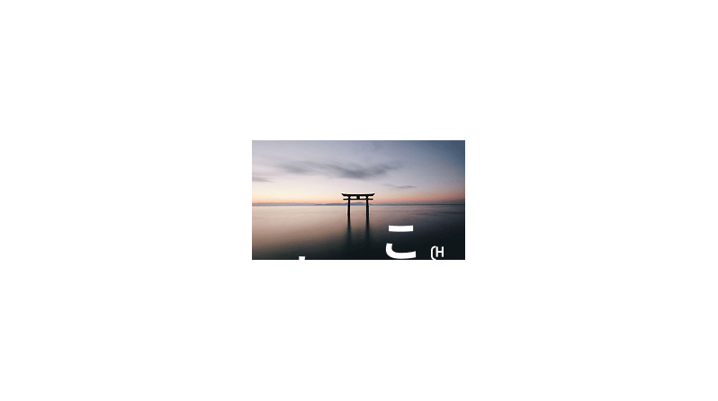
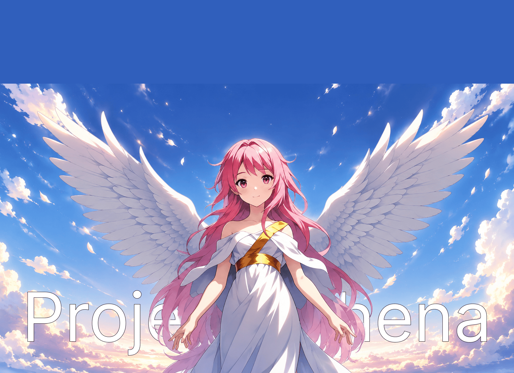
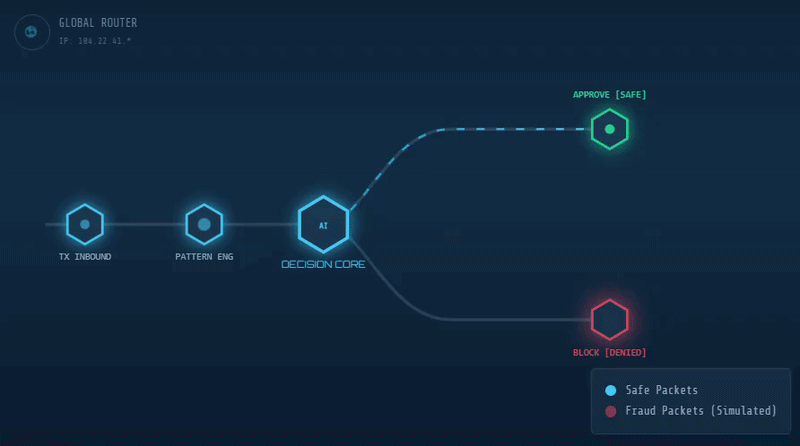
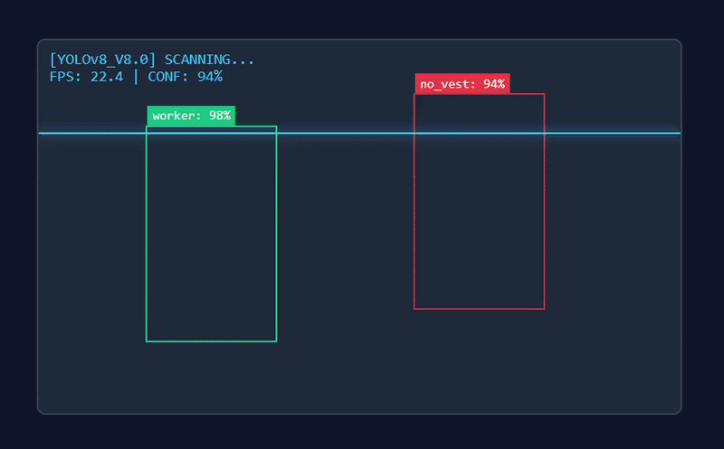

<p align="center">
  
</p>

<h3 align="center">
Backend Developer • Full Stack Builder • AI Enthusiast • Problem Solver
</h3>

<p align="center">
  
</p>

---
<h1 align="center">🚀 About Me</h1>

```yaml
Name: Mohammed Sulthan G

Role: Software Developer

Focus:
  - Backend Development
  - Full Stack Engineering
  - AI + LLM Applications

Currently Learning:
  - Advanced DSA
  - Kotlin
  - System Design

Current Projects:
  - Athena AI Assistant
  - Platform Flip Game
  - AI Avatar + Blender Integration

Goal:
  Software Engineer at a top product company
```

---

---

<h1 align="center">💻 Tech Stack</h1>


### Languages

<p align="center">
  
  
  
  
</p>

---

### Frontend

<p align="center">
  
  
  
  
</p>

---

### Backend

<p align="center">
  
  
</p>

---

### Database

<p align="center">
  
  
  
</p>

---

### Tools & Technologies

<p align="center">
  
  
  
  
</p>

---

<h1 align="center">📊 GitHub Analytics</h1>

<p align="center">
  
</p>
<p align="center">
  
</p>

<p align="center">
  
</p>

---

<h1 align="center">🔥 Current Focus</h1>


Currently working on:

⚙️ Backend Engineering with Spring Boot  
🤖 AI Assistant Development (Athena)  
🎮 Game Development Projects  
🧠 Solving DSA Problems Daily  
📚 Learning System Design & Kotlin  

---

<h1 align="center">🛠 Featured Projects</h1>


## 🤖 Athena AI Assistant

An AI assistant project focused on:

- Voice Interaction  
- LLM Integration  
- AI Conversation Pipeline  
- Assistant Architecture  

<p align="center">
  
</p>

---

## 🔐 AI Credit Card Fraud Detection

Machine Learning system designed to detect fraudulent transactions.

Built with:

- Python  
- Machine Learning Models  
- Data Analysis  
- Fraud Detection Algorithms  
- Transaction Pattern Recognition  

Achievements:

- Achieved 92% detection accuracy  
- Analyzed 25,000+ transaction records  
- Improved fraud identification efficiency

<p align="center">
  
</p>

---

## 👁️ YOLOv8 Safety Eye

Real-time AI powered safety monitoring system.

Built with:

- Python  
- YOLOv8  
- Computer Vision  
- OpenCV  
- Object Detection Pipeline  

Achievements:

- 90%+ detection accuracy  
- Processed live video streams at 20+ FPS  
- Reduced manual monitoring by 70%

<p align="center">
  
</p>

---

## ☕ Spring Boot Backend Projects

Projects involving:

- Authentication Systems  
- REST APIs  
- CRUD Operations  
- PostgreSQL Integration  

---

<h1 align="center">🧠 Problem Solvin</h1>

Currently practicing:

✅ Arrays  
✅ Strings  
✅ Sliding Window  
✅ Binary Search  
✅ Trees  
✅ Graphs  
✅ Dynamic Programming  

Platforms:

- LeetCode
- HackerRank
- CodeChef

---

<h1 align="center">📈 Development Graph</h1>


<p align="center">


</p>

---

<h1 align="center">🌐 Connect With Me</h1>

<p align="center">
  <a href="https://www.linkedin.com/in/mohammed-sulthan-b64b17308/" target="_blank">
    
  </a>

  <a href="https://github.com/MohammedSulthan07" target="_blank">
    
  </a>

  <a href="mailto:msulthan139@gmail.com" target="_blank">
    
  </a>
</p>

---

<h1 align="center">👀 Profile Views</h1>

<p align="center">
  
</p>

---

<h1 align="center">⚡ Philosophy</h1>

<p align="center">
  
</p>


```java
while(alive){
   learn();
   music();
   build();
   improve();
   repeat();
}
```

---

<h1 align="center">Thanks for visiting my profile ⭐</h1>

---

<h1 align="center">⭐ If you like my projects, drop a star ⭐</h1>


<p align="center">


</p>
